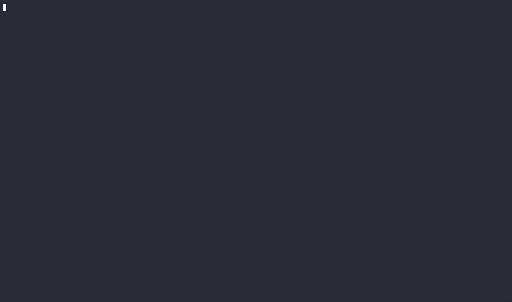

<div align="center">

# DockMate 🐳
A terminal-based Docker container manager that actually ***works***.

---

<!-- Badges -->


</div>

**Note:** Renamed from _DockWatch_ to avoid confusion with existing project




## What is this?

Tired of typing `docker ps` a million times? me too. This is a simple TUI (text user interface) that lets you manage docker containers without leaving your terminal. Think htop but for docker.

## Features

- Live container stats (CPU, memory, PIDs, Net I/O, Block I/O)
- Start/stop/restart containers with a single keypress
- View container logs (last 100 lines)
- Interactive shell access
- Sort by any column
- Auto-refreshes every 2 seconds
- Keyboard-driven (no mouse needed)
- Responsive to terminal resize

## Requirements

- Docker installed and running
- Linux (tested on Ubuntu/Debian)
- Go 1.24+ (IF building from source)

*Note: Should work on macOS with Docker. Windows support untested.*

## Installation

Here's the updated version:

You can install DockMate quickly using the installer script, or build it from source if you prefer.

### Quick Install (Recommended)

```
curl -fsSL https://raw.githubusercontent.com/shubh-io/dockmate/main/install.sh | bash
```

**If the above fails**, download and run:

```
curl -fsSL https://raw.githubusercontent.com/shubh-io/dockmate/main/install.sh -o install.sh
bash install.sh
```

### Build from Source

If you want to tweak or contribute:

```
git clone https://github.com/shubh-io/dockmate
cd dockmate
go build -o dockmate

./dockmate

# Optional: Make it available system-wide
sudo mv dockmate /usr/local/bin/
```

Run the app:

```bash
dockmate
```

Update anytime

```bash
# from the running install method
dockmate update

# or simply re-run the installer
curl -fsSL https://raw.githubusercontent.com/shubh-io/dockmate/main/install.sh | bash
```

Verify downloads (optional but recommended)

If you want extra assurance when installing a release, we publish SHA256 checksums alongside binaries. After downloading a release asset and its `.sha256` file you can verify the binary locally:

```bash
# download the binary and the checksum file (example for v0.0.2)
curl -fsSL -o dockmate-linux-amd64 https://github.com/shubh-io/dockmate/releases/download/v0.0.2/dockmate-linux-amd64
curl -fsSL -o dockmate-linux-amd64.sha256 https://github.com/shubh-io/dockmate/releases/download/v0.0.2/dockmate-linux-amd64.sha256

# verify (Linux)
sha256sum -c dockmate-linux-amd64.sha256

# or on macOS
shasum -a 256 -c dockmate-linux-amd64.sha256
```

The installer script will also attempt to fetch and verify a matching `.sha256` file automatically; if the checksum is present and doesn't match the downloaded binary, installation will abort.

## Usage

```
dockmate
```

That's it. Navigate with arrows, press keys to manage containers.

## Keyboard shortcuts

| Key | What it does |
|-----|--------------|
| `↑/↓` or `j/k` | navigate containers |
| `Tab` | switch to column mode |
| `←/→` or `h/l` | navigate columns (in column mode) |
| `Enter` | sort by selected column (in column mode) |
| `s` | start container |
| `x` | stop container |
| `r` | restart container |
| `l` | view logs |
| `e` | open interactive shell |
| `d` | remove container |
| `q` or `Ctrl+C` | quit |

## Why another docker TUI?

Because I wanted something lightweight that just works. No config files, no setup, just run it and manage your containers.

## Roadmap

- [ ] Remote docker host support
- [ ] Resource usage graphs  
- [ ] Docker compose integration
- [ ] Container search/filter
- [ ] .deb package


Got ideas? Open an issue!

## Contributing

Found a bug? Got an idea? Open an issue or send a PR.

## License

MIT License - use it however you want

## Credits

Built by [@shubh-io](https://github.com/shubh-io) while learning Go and Docker.

If you find this useful, star it ⭐
